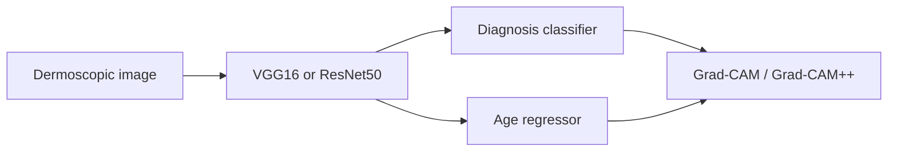

<div align="center">

# HAM10000 Skin Lesion Classification and Age Regression

### Transfer-learning baselines with Grad-CAM and Grad-CAM++

[](https://www.python.org/)
[](https://pytorch.org/)
[](https://www.kaggle.com/datasets/kmader/skin-cancer-mnist-ham10000)

</div>

## Overview

This experimental repository evaluates VGG16 and ResNet50 transfer learning on two HAM10000 tasks:

- seven-class skin-lesion classification; and
- patient-age regression from dermoscopic images.

It also generates Grad-CAM and Grad-CAM++ visualizations for both prediction tasks.

## Data pipeline

- 10,015 original metadata rows
- 9,958 records after cleaning
- 7,962 training, 1,006 validation, and 990 test images
- ImageNet normalization and training-only augmentation
- Class weighting for imbalanced diagnosis labels

## Saved experiment results

| Model | Classification accuracy | Macro F1 | Age MAE |
|---|---:|---:|---:|
| VGG16 | 0.7202 | 0.5854 | 10.7676 years |
| ResNet50 | **0.7556** | **0.6138** | **10.4093 years** |

ResNet50 performed better in both tasks in the saved run. The moderate macro F1 also shows that overall accuracy alone hides difficulty on minority lesion classes.

## Workflow



## Repository contents

```text
skin-cancer-multitask-learning/
├── notebooks/ham10000_multitask_models.ipynb
├── requirements.txt
└── README.md
```

The public notebook copy has no saved outputs or credentials. It can regenerate checkpoints, metrics, comparison tables, learning curves, confusion matrices, and explanation maps.

## Limitations

- One dataset and one split
- Strong class imbalance
- Age is a noisy demographic target and should not be treated as a biological-age estimate
- No external or patient-grouped validation is demonstrated
- Explanation maps do not prove clinically correct reasoning

## Responsible-use notice

This is an educational research experiment and must not be used for melanoma screening, diagnosis, or patient management.

## Contact

**Protik Biswas** · [GitHub](https://github.com/pkhunter47) · [LinkedIn](https://www.linkedin.com/in/protik-biswas-83001827b/) · [Email](mailto:protikbiswas3099@gmail.com)
